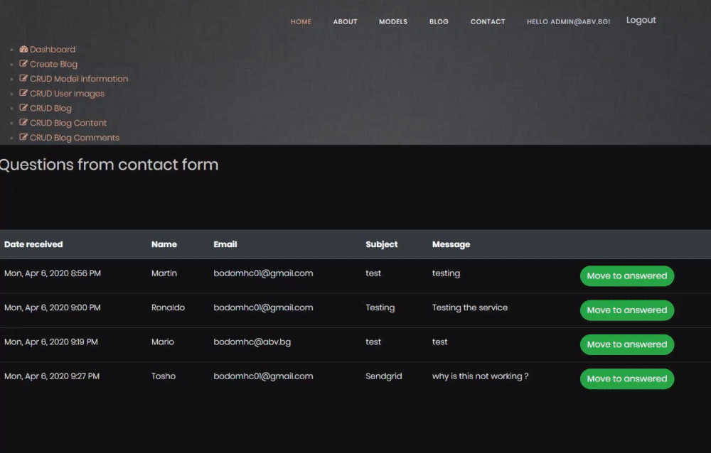

# Model4You
Model4You aims to help professional or amature models to get more exposure and hiring opportunities.

This my first project made for SoftUni ASP.NET Core project defense. 
Huge thanks to @NikolayIT for the template, as well one of the best lecturer at SoftUni.
Also huge thanks to @StoyanShopov for all of the help, support and knowledge he gives to the students. 

Here you can check out some of the functionality and look of the website. ⤵️

Home page view

Blog/Article view

Profile/Profile page view

User booking view

User album view

Book model view

Administration view

